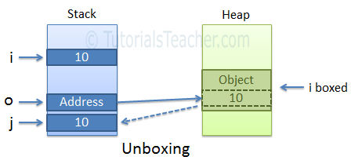

# Components & Templates

## Template reference variables \( \#var \)

 A **template reference variable** is often a reference to a DOM element within a template. It can also be a reference to an Angular component or directive or a [web component](https://developer.mozilla.org/en-US/docs/Web/Web_Components).  You can refer to a template reference variable _anywhere_ in the template. 

```markup
<form (ngSubmit)="onSubmit(heroForm)" #heroForm="ngForm">
  <div class="form-group">
    <label for="name">Name
      <input class="form-control" name="name" required [(ngModel)]="hero.name">
    </label>
  </div>
  <button type="submit" [disabled]="!heroForm.form.valid">Submit</button>
</form>
<div [hidden]="!heroForm.form.valid">
  {{submitMessage}}
</div>
```

 The scope of a reference variable is the _entire template_. Do not define the same variable name more than once in the same template. The runtime value will be unpredictable.

## Input and Output properties

You can only bind to another component or directive through its Input and Output properties.

An _Input_ property is a _settable_ property annotated with an `@`[`Input`](https://angular.io/api/core/Input) decorator. Values flow _into_ the property when it is data bound with a [property binding](https://angular.io/guide/template-syntax#property-binding)

An _Output_ property is an _observable_ property annotated with an `@`[`Output`](https://angular.io/api/core/Output) decorator. The property almost always returns an Angular [`EventEmitter`](https://angular.io/api/core/EventEmitter). Values flow _out_ of the component as events bound with an [event binding](https://angular.io/guide/template-syntax#event-binding).



 All data bound properties must be TypeScript _public_ properties. Angular never binds to a TypeScript _private_ property.


```typescript
@Input()  hero: Hero;
@Output() deleteRequest = new EventEmitter<Hero>();
```

### Input or output?

 _Input_ properties usually receive data values. _Output_ properties expose event producers, such as [`EventEmitter`](https://angular.io/api/core/EventEmitter) objects.



### Aliasing input/output properties 

 You can specify the alias for the property name by passing it into the input/output decorator like this:

```typescript
@Output('myClick') clicks = new EventEmitter<string>(); //  @Output(alias) propertyName = ...
```

## The safe navigation operator \( ?. \) and null property paths

### **safe navigation operator \(`?.`\)**

 The Angular **safe navigation operator \(`?.`\)** is a fluent and convenient way to guard against null and undefined values in property paths. Here it is, protecting against a view render failure if the `currentHero`is null.

```typescript
<!-- No hero, no problem! -->
The null hero's name is {{nullHero?.name}}
```

### The non-null assertion operator \( ! \)

 As of Typescript 2.0, you can enforce [strict null checking](http://www.typescriptlang.org/docs/handbook/release-notes/typescript-2-0.html) with the `--strictNullChecks` flag. TypeScript then ensures that no variable is _unintentionally_ null or undefined.

 The _Angular_ **non-null assertion operator \(`!`\)** serves the same purpose in an Angular template.

```markup
<!--No hero, no text -->
<div *ngIf="hero">
  The hero's name is {{hero!.name}}
</div>
```

 Unlike the [_safe navigation operator_](https://angular.io/guide/template-syntax#safe-navigation-operator), the **non-null assertion operator** does not guard against null or undefined. Rather it tells the TypeScript type checker to suspend strict null checks for a specific property expression.  You'll need this template operator when you turn on strict null checks. It's optional otherwise.

## The `$any` type cast function \(`$any( <expression> )`\)

 Sometimes a binding expression will be reported as a type error and it is not possible or difficult to fully specify the type.

```markup
<!-- Accessing an undeclared member -->
<div>
  The hero's marker is {{$any(hero).marker}}
</div>
```

