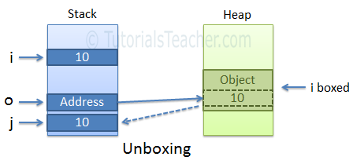

# Conversion

Implicit conversion is done by the compiler: 

1. When there is no loss of information if the conversion is done
2. If there is no possibility of throwing exceptions during the conversion

The following is an implicit data types conversion table.

| Implicit Conversion From | To |
| :--- | :--- |
| sbyte | short, int, long, float, double, decimal |
| byte | short, ushort, int, uint, long, ulong, float, double, decimal |
| short | int, long, float, double, or decimal |
| ushort | int, uint, long, ulong, float, double, or decimal |
| int | long, float, double, or decimal. |
| uint | long, ulong, float, double, or decimal |
| long | float, double, or decimal |
| ulong | float, double, or decimal |
| char | ushort, int, uint, long, ulong, float, double, or decimal |
| float | Double |

Difference between Parse and TryParse 

1. If the number is in a string format you have 2 options - Parse\(\) and TryParse\(\)
2. Parse\(\) method throws an exception if it cannot parse the value, whereas TryParse\(\) returns a bool indicating whether it succeeded or failed.
3. Use Parse\(\) if you are sure the value will be valid, otherwise use TryParse\(\)

## Boxing

While working with these data types, you often need to convert value types to reference types or vice-versa.These conversion processes are called boxing and unboxing.

**Boxing** is the term for turning a **value** type \(int, double, float, Guid, etc.\) into a **reference** type \(System.Object, System.String, etc.\). Doing this boxing operation allocates memory on the heap \(which the garbage collector will eventually need to reclaim\). 

```csharp
int i = 10;
object o = i; //performs boxing
```

As you know, all the reference types stored on heap where it contains the address of the value and value type is just an actual value stored on the stack.


**Unboxing** is the reverse of this process, taking a reference type and turning it into a value type.

```csharp
object o = 10;
int i = (int)o; //performs unboxing
```



## Casting

Casting is when you convert a basic type to another basic type \(like from an int to a long\), or when you change the type of a reference \(like from List to IEnumerable\).

Casting is taking a type \(say, System.Object\) and treating it as another type \(say, System.String\). When you box something in C\#, you are casting it to another type. The difference is that it allocates additional memory as a new reference type is created.

Bottom line: boxing is a special kind of cast that converts a value type to a reference type, which requires the allocation of a new reference type.

